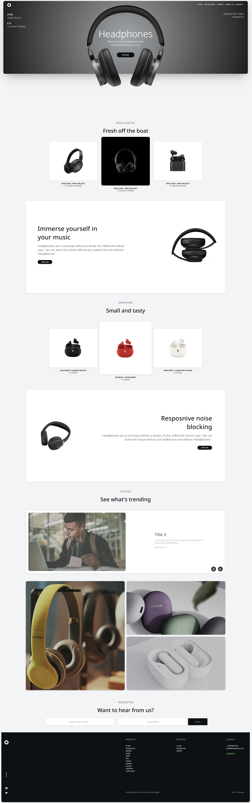
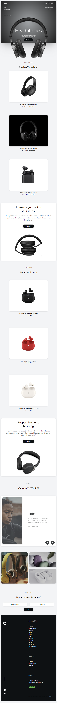

# Headphones - ecommerce page 

Case study was to write elegant and bright page for headphones ecommerce store.

Live link:

https://webski-dev.github.io/Headphones-ecommerce-page/

## Stack 

HTML/SCSS/vanlla JS

### LIBRARIES

gSap library
ionicons
towfique slider library

### Layout

The designs were created to the following widths:

- Mobile (min): 320px
- Desktop: 1440px

### Demo

Live link:

https://webski-dev.github.io/Headphones-ecommerce-page/

### Features

- Mobile/ Desktop menu (JS toggle)
- Fullscreen/mobile mode (mediaQuery)
- Responsive slider
- gSap onscroll trigger with opacity effect
- Hover state on main button (could be apply to others but I was too lazy ;)
- Hover state on featured product images
- Cross platform
- keyframes animations

### Screenshots

Desktop view :

Mobile view :

Responsive slider :

Mediaquery manipulations

mobile:

desktop:

#### THANKS!
